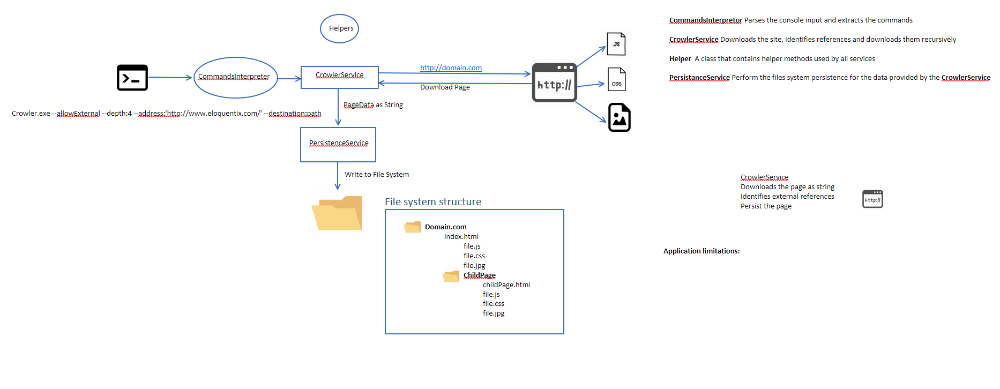

# WebCrawler

This is a .Net C# Web Crawler made to demonstrate some C# skills
Note: This is not made to be a and to end produc , not yet at least.

## Project requirements

Să creezi console app in C# care să facă crawl la un
website și să-l salveze pe disk. Principalele condiții sunt:

1. Să-l poți configura cât de adânc să navigheze
2. Să se poată vedea cât mai mult din website-ul descărcat local când
   nu există o conexiune la internet
3. Să nu descarce tot internetul — să se limiteze doar la link-urile
   de sub domeniul specificat ca argument când se execută comanda
4. Proiectul să conțină un README file în care să descrii în limba
   engleză arhitectura/structura proiectului

Tema e free-style — faci cum vrei tu și cu ce vrei tu in C#, dar fara sa folosesti un lib de crawling. Vrem să vedem cum gândești arhitectura și cum structurezi
codul când n-ai restricții, etc. Dacă ai idei extra sau vrei să schimbi
ceva pentru că ți se pare mai bine, go for it.

Bonus points pentru:

1. Execuție paralelă
2. Teste

## How much was done

1. The console supports commands that can and as much functionlaity and configuration as nedded
2. Currenly the site html page and references like .css, images, logo, are downloaded and of the related pages.
   Limitations: in order for the links to wrok they must be conversted to abslote kinks. See To do 1.
3. This feature will be supported, the commands exist but is not fully implemented. See To do 2.
4. Work in progress

Bonuses

1. The project uses Async Await and after the first scan is done and all references(links) are optained they are downloaded in parallel. Most of the work is done in a non blocking way.
2. The project has unit Tests, see WebCrawler done with MSUnit Tests, 5 tests for now to test the Commands interpretation and DIsk persistence.

To be continued........

## To do

1. Convert all links to absolute so all site scripts and resources can be loaded from disk.
2. Commands are implemented but functionality nedds to be completed.

## Architecture

To be detailed

https://github.com/diaconu13/WebCrawler/blob/master/architecture.png


## Getting Started

The project is a console application that will go throw a website and download the page and all related dependencies, scripts and related pages

### Prerequisites

//todo

### Running

Sample command

```
webcrawler.exe --allowExternal --address:http://www.eloquentix.com/ --destination:C:\Users\dan.diaconu\source\repos\WebCrawler\WebCrawler\bin\Debug --depth:2
```

## Running the tests

//todo

### Break down into end to end tests

//todo

### And coding style tests

//todo

## Deployment

//todo

## Built With

//todo

## Contributing

//todo

## Versioning

//todo

## Authors

//todo

## License

This project is licensed under the MIT License - see the [LICENSE.md](LICENSE.md) file for details

## Acknowledgments

//todo
