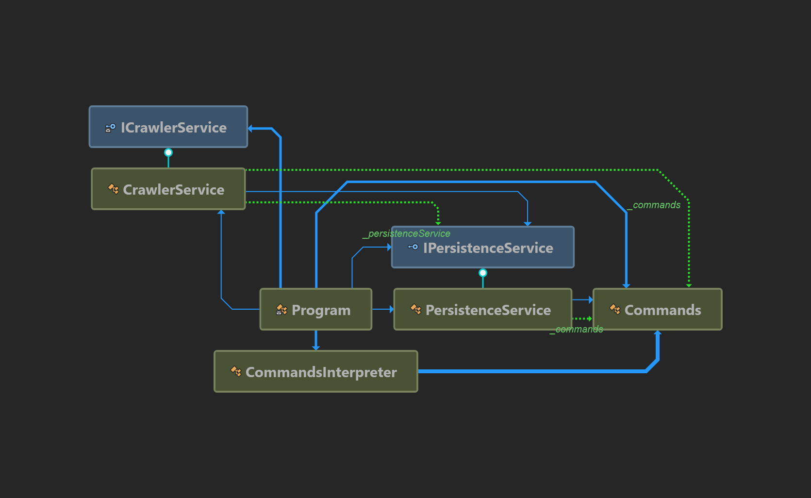

# WebCrawler

This is a .Net C# Web Crawler made to demonstrate some C# skills

Note: This is not made to be a and to end product , not yet at least.

## Project requirements

Create C # app console that crawls to a website and save it to disk. The main requirements are:

1. You can configure it how deep to navigate
2. Be able to see as much of the locally downloaded website when there is no internet connection
   Do not download the entire Internet - just limit the links below the specified domain as an argument when executing the command
3. The project should contain a README file describing the architecture / structure of the project in English

The theme is free-style - do what you want and what you want in C #, but without using a crawling lib. We want to see how you think about architecture and how you structure the code when you have no restrictions, etc. If you have extra ideas or want to change something because it looks better, go for it.

Bonus points for:

1. Parallel execution
2. Tests

## How much was done

1. The console supports commands that can and as much functionality and configuration as needed
2. Currently the site html page and references like .css, images, logo, are downloaded and of the related pages.
   Limitations: in order for the links to work they must be converted to absolute kinks. See To do 1.
3. This feature will be supported, the commands exist but is not fully implemented. See To do 2.
4. Work in progress

Bonuses

1. The project uses Async Await and after the first scan is done and all references(links) are obtained they are downloaded in parallel. Most of the work is done in a non blocking way.
2. The project has unit Tests, see WebCrawler done with MSUnit Tests, 5 tests for now to test the Commands interpretation and DIsk persistence.

## To do

1. Convert all links to absolute so all site scripts and resources can be loaded from disk.
2. Commands are implemented but functionality needs to be completed
   By functionality it is meant that the dephness is not yet controlled (might download the internet :) ) and the downloaded references such as .css and .js is not loaded in index.html page links needs to be absolute to local system.

## Architecture

The applications is a Console application that has some specialized services and classes to accomplish the task at hand and also be testable and easy to extend and maintain.

For the purpose of Single responsibility principle, Liskov Substitution principle and Interface Segregation We have Services that have interfaces defined in order to make them reusable, testable.
We also use a Dependency injection framework to have all the functionality as decoupled and reusable as possible.
Dependency injection with Services and interfaces go hand in hand. Is difficult otherwise to have SOLID principles comply without this trio.

### CommandsInterpreter

this has the only gob of transforming an array of string arguments into a concrete Commands Object that contains all commands and values and that can be injected where is needed.

### CrawlerService

This service is used to perform the site downloading and identifying the external resources and references in order to perform recursive resource downloads.
This service will use PersistanceService so save it's data.

### PersistanceService

This service persists data provided from CrawlerService.
It purpose is to identify where to save data and make sure tree structure on file system is correctly maintained.
By Data is meant usually html files, web site resources, like .js, .css, images, etc.
This service must also identify teh type of data to be saved and save-it accordingly.
For example a text file persistance is a bit different then a image file.

Since the entire data si just saved and accessed from the disk there is no need for a DataBase.

### Helpers

The application contains also Helpers and other classes that are used to make code more reusable and tastable but the main logic flow is given by the services and services dependency graph.


### Dependencies Graph



### Prerequisites

.Net 4.6

### Running

Sample command

```
webcrawler.exe --allowExternal --address:http://www.eloquentix.com/ --destination:C:\Users\dan.diaconu\source\repos\WebCrawler\WebCrawler\bin\Debug --depth:2
```

## Running the tests

Build and run the test
On the Build menu, choose Build Solution.

If Test Explorer is not open, open it by choosing Test > Windows > Test Explorer from the top menu bar.

Choose Run All to run the test.

While the test is running, the status bar at the top of the Test Explorer window is animated. At the end of the test run, the bar turns green if all the test methods pass, or red if any of the tests fail.

In this case, the test fails.

Select the method in Test Explorer to view the details at the bottom of the window.

Rerun the test
In Test Explorer, choose Run All to rerun the test. The red/green bar turns green to indicate that the test passed.

See [Create and run unit tests for managed code](https://docs.microsoft.com/en-us/visualstudio/test/walkthrough-creating-and-running-unit-tests-for-managed-code?view=vs-2019) for more details.

## Deployment

Copy paste the WebCrawler.exe in the desired location and run it.
Make sure the application has access to the File system for persistance.

## Built With

//todo

## Contributing

//todo

## Versioning

//todo

## Authors

//todo

## License

This project is licensed under the MIT License - see the [LICENSE.md](LICENSE.md) file for details

## Acknowledgments

//todo
